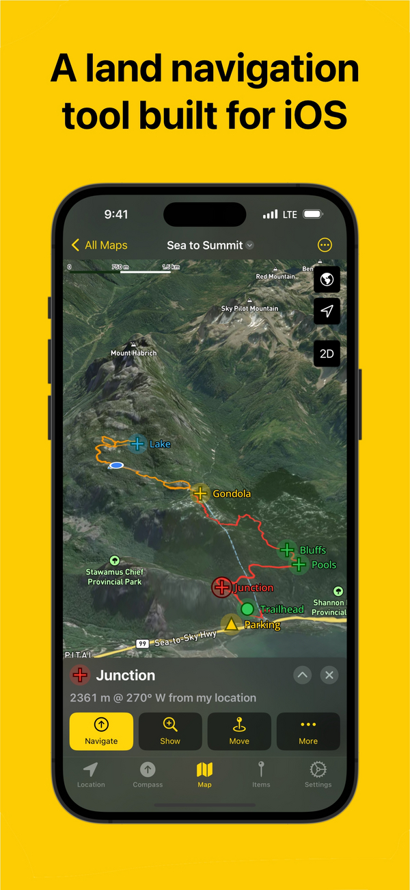
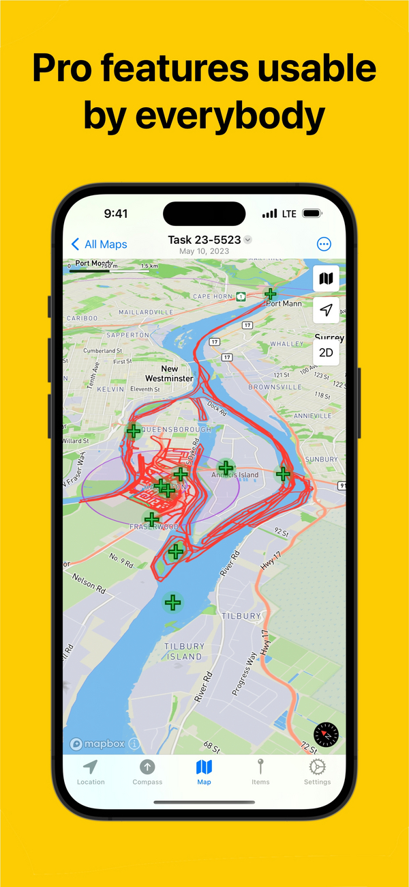
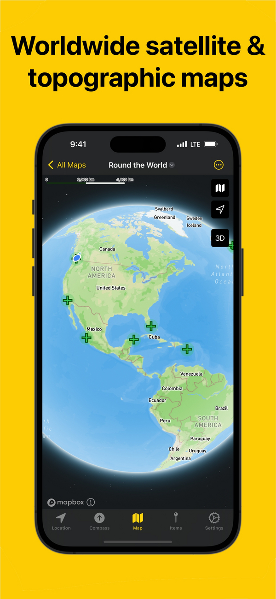
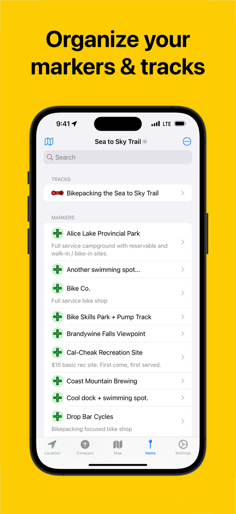
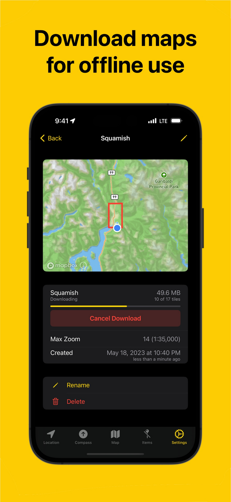

## Additional Features

- Compass with inclinometer
- Show sunset & sunrise times, moon phase, and magnetic declination
- GPX import/export for waypoints, tracks, and routes
- Customizable coordinate formats and units including UTM, MGRS and Mils
- Document interface to organize map data
- Universal app works on iOS and iPad (macOS comming soon)
- iCloud sync, plan on your iPad, navigate on your phone
- No ads and no tracking
- Generous free trial, no subscription, single in-app purchase to buy
- Support independent app developer with a passion for the outdoors

