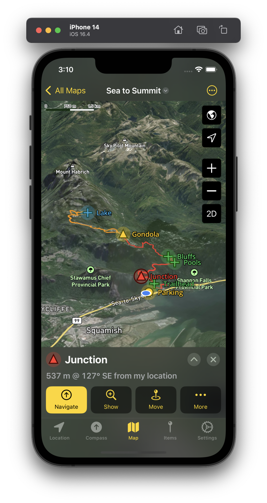
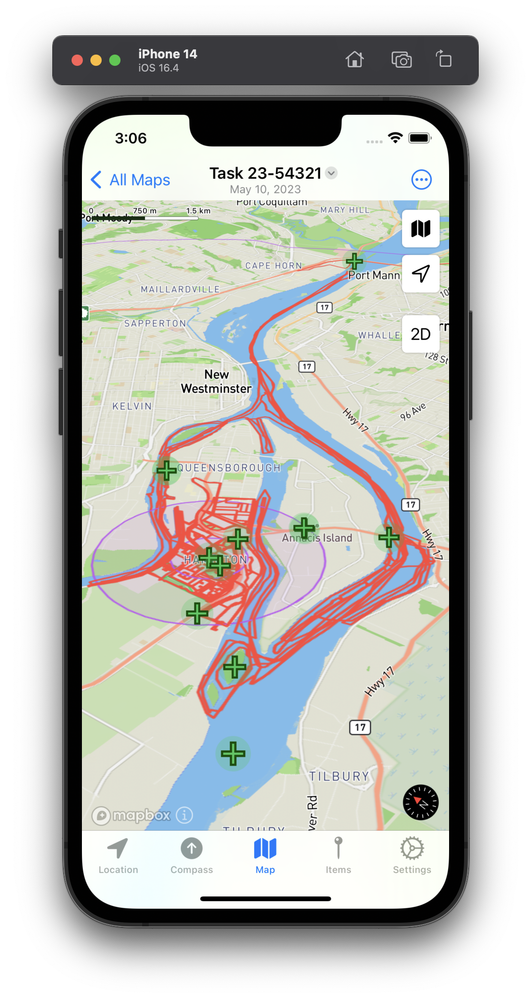
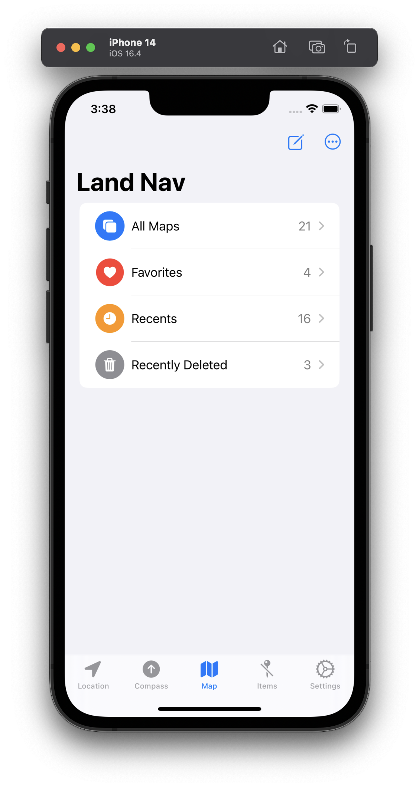

#  {{ page.title }}

A land navigation GPS and offline map app built for iOS. No ads. Privacy respected.

- 3D topographical and satellite maps
- Downloadable maps for offline use
- Compass with inclinometer
- GPX import/export for waypoints, tracks, and routes
- Customizable coordinate formats and units including MGRS and Mils
- Document interface to organize map data
- Universal app works on iOS and iPad (macOS comming soon)
- iCloud sync, plan on your iPad, navigate on your phone
- No ads and no tracking
- Generous free trial, no subscription, single in-app purchase to buy

Available on [Test Flight](https://testflight.apple.com/join/H0KyC9eP) while in beta testing. Launches soon!

<!--

-->

By [Gerry Shaw](https://gshaw.ca) • [Land Nav Privacy Policy](/privacy)
